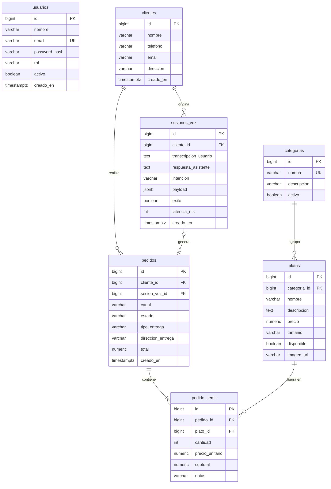

# Modelo Entidad-Relación

```mermaid
erDiagram
    usuarios {
        bigint id PK
        varchar nombre
        varchar email UK
        varchar password_hash
        varchar rol
        boolean activo
        timestamptz creado_en
    }
    clientes {
        bigint id PK
        varchar nombre
        varchar telefono
        varchar email
        varchar direccion
        timestamptz creado_en
    }
    categorias {
        bigint id PK
        varchar nombre UK
        varchar descripcion
        boolean activo
    }
    platos {
        bigint id PK
        bigint categoria_id FK
        varchar nombre
        text descripcion
        numeric precio
        varchar tamanio
        boolean disponible
        varchar imagen_url
    }
    pedidos {
        bigint id PK
        bigint cliente_id FK
        bigint sesion_voz_id FK
        varchar canal
        varchar estado
        varchar tipo_entrega
        varchar direccion_entrega
        numeric total
        timestamptz creado_en
    }
    pedido_items {
        bigint id PK
        bigint pedido_id FK
        bigint plato_id FK
        int cantidad
        numeric precio_unitario
        numeric subtotal
        varchar notas
    }
    sesiones_voz {
        bigint id PK
        bigint cliente_id FK
        text transcripcion_usuario
        text respuesta_asistente
        varchar intencion
        jsonb payload
        boolean exito
        int latencia_ms
        timestamptz creado_en
    }

    clientes    ||--o{ pedidos       : "realiza"
    clientes    ||--o{ sesiones_voz  : "origina"
    sesiones_voz |o--o| pedidos      : "genera"
    categorias  ||--o{ platos        : "agrupa"
    pedidos     ||--|{ pedido_items  : "contiene"
    platos      ||--o{ pedido_items  : "figura en"
```
